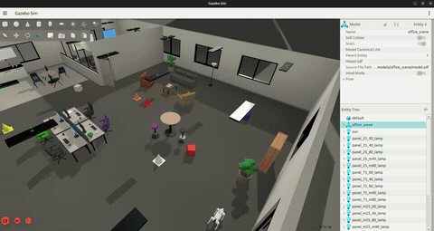
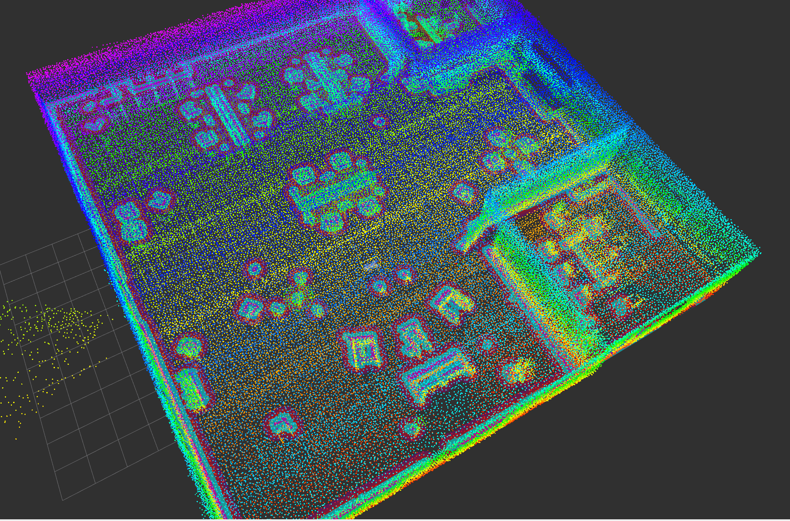
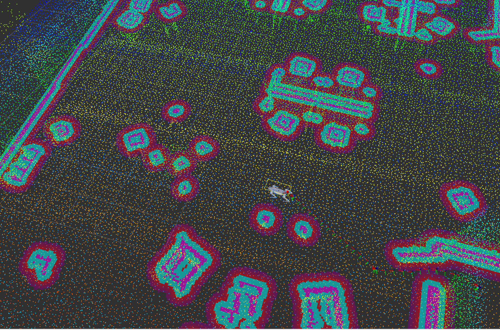

# Go2 Office Navigation



A Unitree Go2 quadruped, simulated in Gazebo Harmonic inside a procedurally-generated
office built in Blender, carrying a head-mounted RGBD camera and a back-mounted 3D lidar.
Drivable by keyboard with full sensor visualization in RViz; SLAM mapping and **Nav2
point-to-point navigation both work** (KISS-ICP drives the real odometry — see
[Navigation](docs/ARCHITECTURE.md#kiss-icp-real-odom-source)); you can send it a goal by
clicking in RViz or from the command line (see
[Navigation](docs/ARCHITECTURE.md#nav2-point-to-point-navigation)). Fully
autonomous frontier exploration (the robot picking its own goals to map the whole scene
unattended) is not implemented yet — see [Known issues](docs/KNOWN_ISSUES.md) for that and
for an open gait-stability bug.

<p align="center">
  
  
</p>

*Live proof of the "SLAM mapping ... works" claim above: the point cloud KISS-ICP has
accumulated of the office (left, top-down — desks, the conference table, lounge seating
all visible as clusters), and the robot navigating among those landmarks in that same
cloud (right). See [Navigation](docs/ARCHITECTURE.md#kiss-icp-real-odom-source) for what
this display actually is.*

```
Blender scene  ──export_sdf.py──>  Gazebo world + robot  ──sensors + TF──>  RViz / rosbag
(blender/)                          (src/go2_nav_bringup/)                   (visualize/record)
```

---

## Quick start

`~/go2_nav` is wherever you cloned this repo. Every terminal below needs this once, after
each build — including a terminal you already sourced it in before that build, since
re-running it is the only way it'll pick up a package that didn't exist yet last time
(a "Package 'x' not found" error usually just means this terminal's overdue for it):

```bash
source ~/go2_nav/install/setup.bash
```

Starts everything — simulation, odometry, SLAM/Nav2, and RViz — in the right order with
the right delays between them, and cleans up any leftover processes from a previous run
first. `--odom` picks the lidar odometry backend (default `kiss_icp`; `fast_lio` runs
`spark_fast_lio` instead — see the Layout section and Launch commands table below):

```bash
./src/go2_nav_bringup/scripts/run_stack.sh
./src/go2_nav_bringup/scripts/run_stack.sh --odom fast_lio
```

**Want more control?** Run each piece in its own terminal so you can restart just one
without tearing down the rest:

```bash
# Terminal 1 — simulation: world, robot, sensors, locomotion
source ~/go2_nav/install/setup.bash
ros2 launch go2_nav_bringup office_sim.launch.py

# Terminal 2 — lidar odometry (start this before SLAM/Nav2)
source ~/go2_nav/install/setup.bash
ros2 launch go2_nav_bringup kiss_icp.launch.py
# (or fast_lio.launch.py — see Launch commands table below)

# Terminal 3 — SLAM + Nav2
source ~/go2_nav/install/setup.bash
ros2 launch go2_nav_bringup nav_stack.launch.py

# Terminal 4 — RViz: view the robot, sensors, and map; click to send Nav2 goals
source ~/go2_nav/install/setup.bash
ros2 launch go2_nav_bringup rviz.launch.py

# Terminal 5 (optional) — drive manually instead of using Nav2
source ~/go2_nav/install/setup.bash
python3 ~/go2_nav/src/go2_nav_bringup/scripts/keyboard_teleop.py
```

Terminals 1, 2, and 4 give you a drivable, visualized robot with manual teleop. Add
Terminal 3 for SLAM mapping and Nav2 navigation — see
[Navigation](docs/ARCHITECTURE.md#nav2-point-to-point-navigation) for how to send it a goal
once it's up (wait for its log to say `Managed nodes are active` first). If Terminal 3
seems stuck partway through starting, it's usually just the machine catching up under
load — give Terminals 1-2 a few seconds to settle first.

**Starting over cleanly:** if something's stuck (a launch died halfway, a stale process is
holding a topic), kill everything project-related before relaunching:
```bash
pkill -9 -f "gz sim|ros_gz_bridge|quadruped_controller/lib|go2_nav_bringup|kiss_icp_node|spark_lio_mapping|rviz2|slam_toolbox|controller_server|planner_server|behavior_server|bt_navigator|waypoint_follower|velocity_smoother|collision_monitor|opennav_docking|route_server|smoother_server|pointcloud_to_laserscan_node|lifecycle_manager"
```

---

## Layout

```
go2_nav/
├── README.md              this file
├── blender/               scene authoring (Blender project) — see blender/README.md
├── src/                    one folder per ROS package — standard colcon workspace layout
│   ├── go2_nav_bringup/     this project's own package — world, launch, config, scripts
│   ├── go2_description/    Go2 URDF/xacro — vendored + patched
│   ├── quadruped_controller/  IK trot-gait controller — vendored + patched
│   ├── quadruped_msgs/    custom msg/srv types for the controller — vendored, unpatched
│   ├── kiss-icp/           lidar-only odometry, the default (git submodule, unpatched)
│   └── spark-fast-lio/     LiDAR-IMU ESKF odometry, alternative to kiss-icp (vendored + patched)
├── docs/                   architecture, navigation, patches, known issues, media
├── bags/                   rosbag output directory
└── install/ build/ log/    colcon artifacts (generated, not source)
```

**Full annotated layout + architecture + data-flow pipeline diagram:
[docs/ARCHITECTURE.md](docs/ARCHITECTURE.md).**

---

## Installation

**See [INSTALL.md](docs/INSTALL.md) for the full, from-scratch walkthrough** — ROS 2 Jazzy and
Gazebo Harmonic setup, every apt package this project needs, cloning, and building.
It's written to work on a genuinely clean Ubuntu 24.04 machine (verified in a clean Docker
container, not just "worked on the machine that already had stuff installed").

Short version, if you already have ROS 2 Jazzy + Gazebo Harmonic (`ros-jazzy-ros-gz`):

```bash
cd ~/go2_nav
rosdep install --from-paths src --ignore-src -r -y
colcon build --symlink-install
```

`--symlink-install` means edits to Python scripts and config/launch/xacro files take effect
immediately on the next run — only C++/CMake changes need a rebuild. `ros2 run` and `ros2
launch` both work (`ros2launch`/`ros2run` are in the apt list above) — see
[docs/ROS2_BASICS.md](docs/ROS2_BASICS.md#ros2-run-and-ros2-launch) for what that gets you
over calling scripts with `python3 <path>` directly. `ros2 lifecycle` is the one CLI verb
still not installed (nothing here needs it).

---

## Launch commands

| Command | What it does | Status |
|---|---|---|  
| `ros2 launch go2_nav_bringup full_stack.launch.py [odom_backend:=fast_lio]` | Everything in one command — office_sim + rviz + odometry + nav_stack, staggered (odom_backend default `kiss_icp`) | ✅ |
| `ros2 launch go2_nav_bringup office_sim.launch.py` | Spawns the office world + Go2 with sensors and locomotion | ✅ |
| `python3 ~/go2_nav/src/go2_nav_bringup/scripts/keyboard_teleop.py` | WASD + arrow-key teleop (needs its own terminal, keyboard focus) | ✅ |
| `ros2 launch go2_nav_bringup rviz.launch.py` | RViz — robot model, camera, map, costmaps, odom trajectory, "2D Nav Goal" tool | ✅ |
| `ros2 launch go2_nav_bringup kiss_icp.launch.py` | KISS-ICP odometry — the default `/robot1/odom` + `odom->base_link` TF source | ✅ |
| `ros2 launch go2_nav_bringup fast_lio.launch.py` | spark_fast_lio (FAST-LIO2) odometry — alternative `/robot1/odom` + `odom->base_link` TF source | ✅ |
| `ros2 launch go2_nav_bringup nav_stack.launch.py` | SLAM + pointcloud_to_laserscan + Nav2 | ✅ |
| `python3 ~/go2_nav/src/go2_nav_bringup/scripts/send_nav_goal.py --x <x> --y <y>` | Send a one-off Nav2 goal from the CLI (`ros2 action` isn't installed) | ✅ |
| `blender -b blender/office.blend --python blender/export_sdf.py` | Re-export the scene after editing it in Blender | ✅ |
| `blender -b --python blender/build_office.py` | Regenerate the scene from scratch — **overwrites `office.blend`** | ✅ |

**Keyboard teleop controls:**

| Keys | Effect |
|---|---|
| `W` / `S` | strafe forward / back |
| `A` / `D` | strafe left / right (gentler than forward/back — upstream's own tuning) |
| `←` / `→` | yaw left / right |
| `↑` / `↓` | stand taller / crouch (stance height, clamped 0.15–0.32 m) |
| `Space` | stop |
| `q` | quit |

Auto-stops ~0.4s after the last keypress (no key-release event from a raw terminal, so this
is the safety net).

**Manual velocity publish** (useful for scripting/testing without the teleop's keyboard
focus requirement):
```bash
ros2 topic pub -r 10 /robot1/cmd_vel geometry_msgs/msg/Twist "{linear: {x: 0.3}}"
```

**Process persistence note:** if you background any of these (`&`), use `setsid ... &
disown`, not `disown` alone — plain `disown` did not reliably survive process-group signals
sent to unrelated jobs during this project's development, leaving Gazebo/RViz orphaned.
Simplest is still just separate foreground terminals, one per command above.

---

## Learn more

| Doc | Covers |
|---|---|
| [docs/ROS2_BASICS.md](docs/ROS2_BASICS.md) | **New to ROS2? Start here.** Workspace layout, colcon build, package.xml, setup.bash, and common day-to-day workflows, all explained using this repo's own files |
| [INSTALL.md](docs/INSTALL.md) | Full from-scratch install walkthrough |

---

## License

This project's own original work (`src/go2_nav_bringup/`, Blender authoring scripts,
documentation) is MIT-licensed — see [LICENSE](LICENSE).
